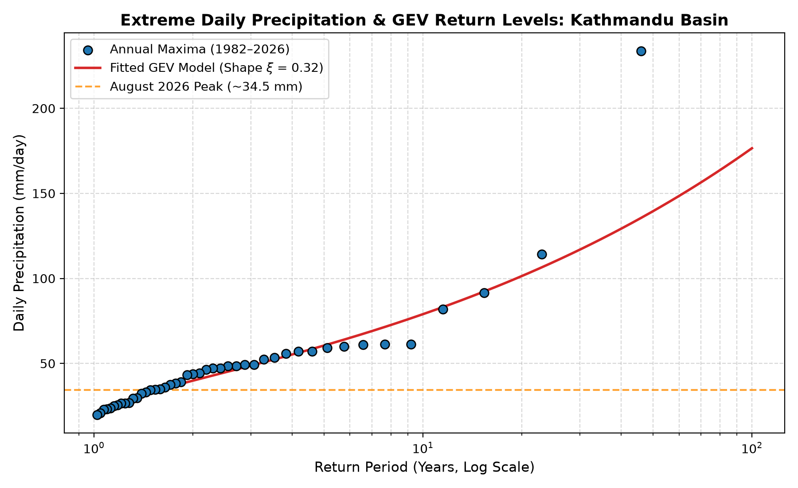
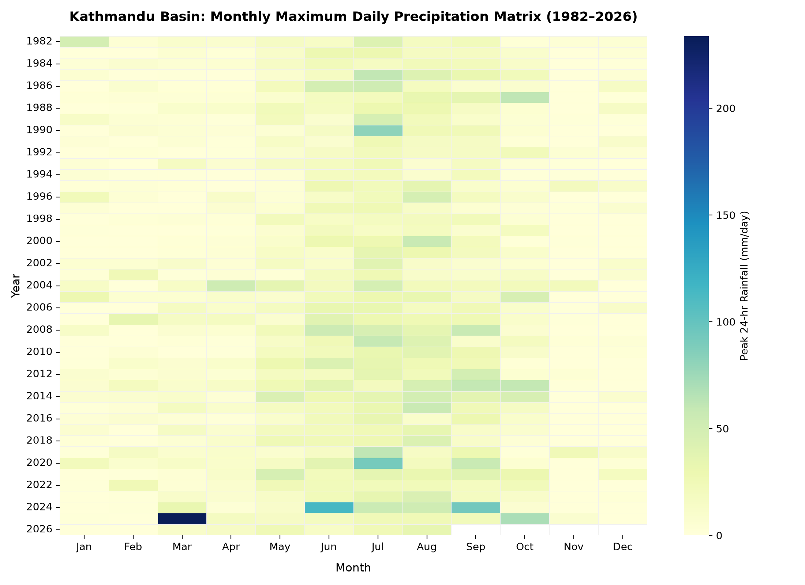
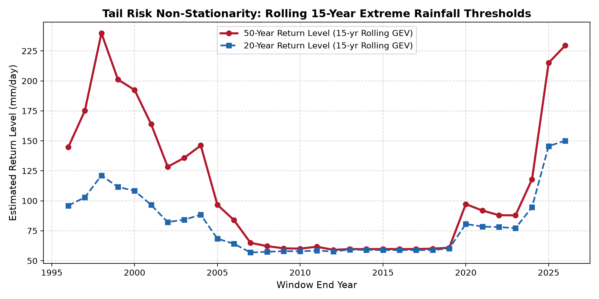

# Kathmandu Basin: Extreme Daily Precipitation & Extreme Value Analysis (1982–2026)

## Overview
This repository provides an empirical Extreme Value Theory (EVT) analysis of daily precipitation extremes in the Kathmandu Valley (27.7172° N, 85.3240° E), motivated by recurrent devastating monsoon flooding, including the catastrophic August 2026 flood event.

The primary objective is to evaluate whether stationary assumptions in traditional peril pricing and municipal drainage criteria remain valid given shifting tail risk in high-altitude Himalayan catchments.

---

## Methodology
- **Data Pipeline:** 44-year daily precipitation series extracted via NASA POWER API (1982–2026).
- **Extreme Value Modeling:** Block Maxima approach fitting a Generalized Extreme Value (GEV) distribution via Maximum Likelihood Estimation (MLE):
  
$$G(z) = \exp \Big( -\Big[ 1 + \xi \Big( \frac{z - \mu}{\sigma} \Big) \Big]^{-1/\xi} \Big)$$

- **Diagnostic Suite:**
  1. **Stationary GEV Return Levels:** Estimating empirical vs. theoretical return periods up to 100 years.
  2. **Seasonal Climatology Heatmap:** Tracking peak daily rainfall intensity across the monsoon calendar (June–September).
  3. **Rolling Window Non-Stationarity:** 15-year rolling GEV fits to detect upward drift in 20-year and 50-year design storms.

---

## Visualizations & Findings

### 1. Stationary GEV Return Level Distribution
Evaluates the baseline distribution of annual maximum daily events against empirical Weibull plotting positions.


### 2. Monsoon Seasonality & Maximum Daily Intensity
Highlights the concentration of high-intensity convective and orographic rainfall during the July–September monsoon window.


### 3. Non-Stationary Return Level Drift (15-Year Rolling Windows)
Demonstrates the compression of return periods, showing that rainfall magnitudes previously classified as 1-in-50-year events are increasingly occurring at lower return intervals.


---

## Actuarial & Risk Transfer Applications
- **Catastrophe Reserving:** Traditional pricing relying on long-term stationary sample means systematically underestimates the tail loss probability (Value-at-Risk and Tail Value-at-Risk).
- **Parametric Trigger Calibration:** Provides empirical thresholds for basis-risk minimization in parametric sovereign catastrophe pools (e.g., SEADRIF-style mechanisms for South Asia).
- **Municipal Infrastructure:** Demonstrates that urban drainage thresholds designed under historical 20-year return assumptions are inadequate under current precipitation distributions.

---

## Reproduction

```bash
git clone [https://github.com/niraulasagar/kathmandu-extreme-precipitation-evt.git](https://github.com/niraulasagar/kathmandu-extreme-precipitation-evt.git)
cd kathmandu-extreme-precipitation-evt
pip install -r requirements.txt

# Run baseline EVT model
python analyze_evt.py

# Generate advanced heatmap and rolling non-stationary diagnostics
python generate_visuals.py
Author
Sagar Niraula

Master of Actuarial Practice, Macquarie University

Former Actuarial Analyst, Nepal Life Insurance Co. Ltd.

LinkedIn Profile
